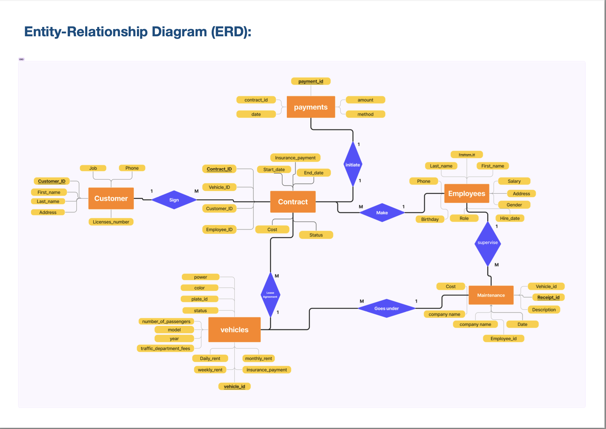

**Car Rental DB System**

**Project Overview**

This project involves the development of a MySQL-based database system for a Jerusalem-based car rental company.
The goal is to streamline the company’s data management processes, transitioning from manual record-keeping using notebooks, papers, and Excel sheets to a fully digital solution.

**Technology Stack**

- **Database:** MySQL
- **Programming Language:** Java
- **Development Environment:** Laptops (HP, Dell, MacBook) running Windows OS and macOS

  

**Data Model**

The system will manage the following entities:

- **Customers:** Unique identifier, first and last name, address, job, license number, and phone number.
- **Employees:** Unique identifier, first and last name, job designation, salary, gender, phone number, address, hire date, and birth date.
- **Contracts:** Unique contract number, start and end dates, insurance payment, cost, status, and employee reference. Each contract is linked to a customer.
- **Vehicles:** Vehicle ID, plate number, color, power, rental rates (daily, weekly, monthly), number of passengers, model, traffic department fees, and year of manufacturing.
- **Payments:** Unique identifier, date, amount, method of payment, and associated contract.
- **Maintenance Records:** Unique identifier, vehicle reference, maintenance description, supervising employee, service company name, cost, and maintenance date.

**Entity Relationships**

- A vehicle can only be leased to one customer at a time.
- A customer can sign multiple contracts simultaneously, each for different vehicles.
- A vehicle can only undergo one maintenance process at a time.
- An employee can manage multiple contracts and supervise the maintenance of multiple vehicles.
- Each contract must be initiated by one payment, and each payment is associated with one contract.

**Team Members**

* Kareem Qutob
* Francis Miadi
* Husain Abugosh
  

